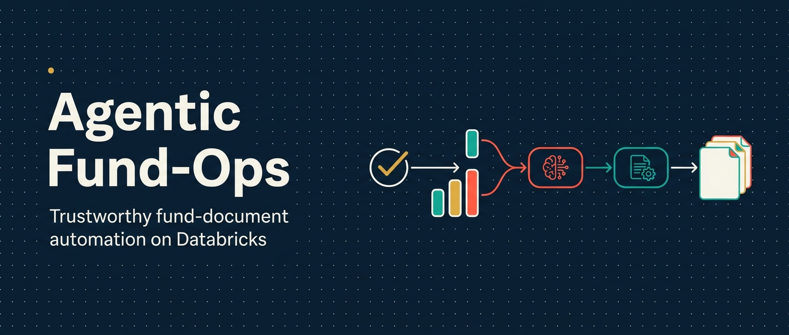
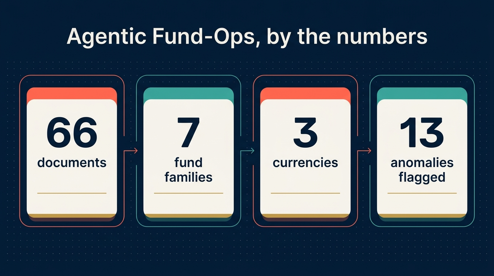
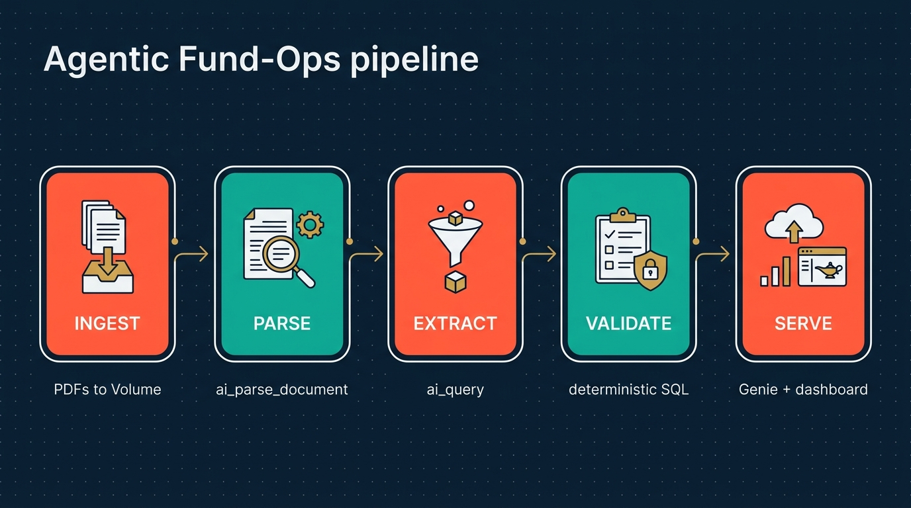
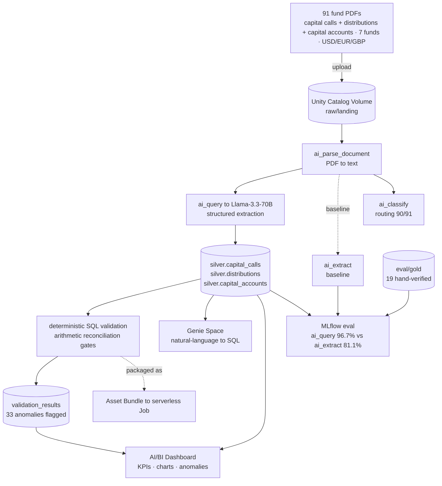
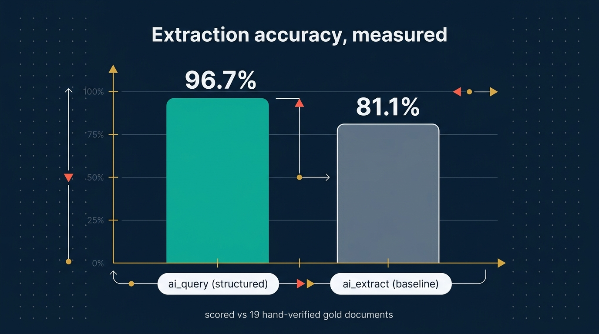
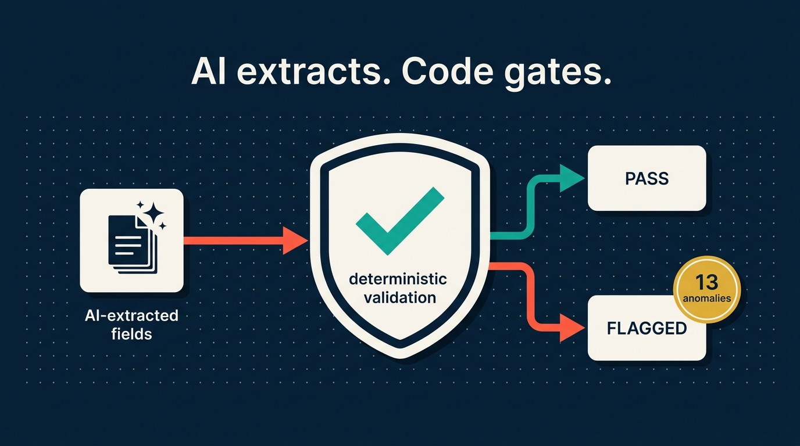
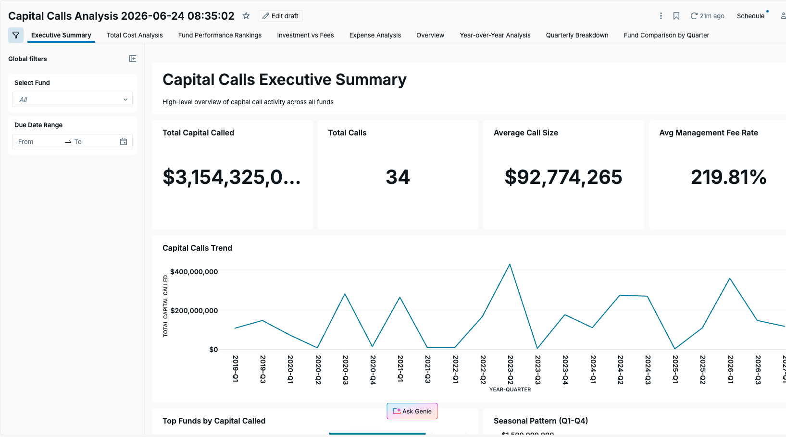
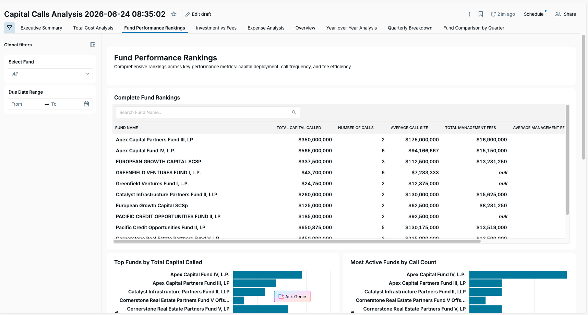
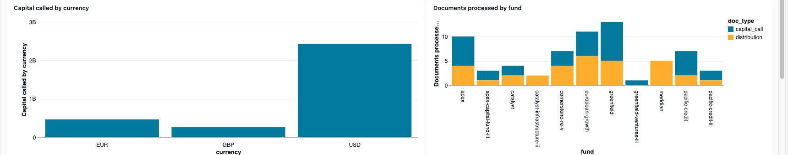

<!-- Hero -->
<p align="center">
  
</p>

<div align="center">


# Agentic Fund-Ops

**An AI agent that turns messy fund-administration PDFs into governed, validated, queryable data — built end-to-end on Databricks with native AI Functions, Unity Catalog, Genie, MLflow, and Asset Bundles.**

[](https://agentic-fund-ops.vercel.app)
[](LICENSE)


**[🔗 Live site](https://agentic-fund-ops.vercel.app)** — queries `fund_ops.silver` **live** via a Vercel serverless function · [static snapshot mirror](https://davendra.github.io/agentic-fund-ops/) on GitHub Pages · [Architecture & diagrams](docs/architecture.md) · [Brand](docs/brand.md) · [Writeup](docs/writeup.md)

</div>

> Capital-call notices, distribution notices and LP capital-account statements arrive as unstructured PDFs in a dozen different layouts. This pipeline parses them, extracts structured fields with an LLM, **gates the model's output with deterministic arithmetic**, lands governed Delta tables, exposes a natural-language query layer and a dashboard, and **measures its own extraction accuracy against a hand-verified gold set** — all packaged as a one-command deployable Databricks Job.



Built as a hands-on demonstration of **agentic data engineering** on Databricks. The agent (Claude Code + Databricks' official agent-skills) authored, ran, and validated this pipeline against a live Unity Catalog workspace. All data is **synthetic** (see [The data](#the-data)).

---

## Contents

- [Architecture](#architecture)
- [Headline results](#headline-results)
- [Dashboards](#dashboards)
- [The data](#the-data)
- [Run it yourself](#run-it-yourself)
- [Repository layout](#repository-layout)
- [Tech](#tech)
- [A note on honesty](#a-note-on-honesty)

---

## Architecture





> **More diagrams** — the agentic build loop, the Job task DAG, the eval harness, the Genie NL→SQL sequence, and full table lineage — are in **[docs/architecture.md](docs/architecture.md)**.

| Stage | Databricks primitive | What it does |
|------|----------------------|--------------|
| Ingest | Unity Catalog **Volume** | Land raw PDFs in governed storage |
| Parse | **`ai_parse_document`** | PDF → text, set-based over the whole Volume |
| Extract | **`ai_query`** + structured output | LLM extraction into typed columns, schema-driven |
| Classify | **`ai_classify`** | Validate doc-type routing |
| Validate | **deterministic SQL** | Arithmetic reconciliation — the trust gate |
| Serve | **Genie Space** | Natural-language → SQL over the silver tables |
| Visualise | **AI/BI Dashboard** (Lakeview) | KPIs, charts + the live anomaly table over the silver tables |
| Evaluate | **MLflow** (GenAI eval) | Score extraction accuracy vs a gold set |
| Deploy | **Asset Bundle** → Job | One-command, scheduled, serverless |

---

## Headline results

### Extraction accuracy — *measure before you trust*



Two **native** strategies, scored field-by-field against 19 hand-verified gold documents (122 field instances):

| Strategy | Overall | Capital calls | Distributions |
|---|---|---|---|
| **`ai_query` (Llama-3.3-70B, structured output)** | **96.7%** | 97.0% | 96.4% |
| `ai_extract` (label-array baseline) | 81.1% | 71.2% | 92.9% |

The ~16-point gap (96.7 − 81.1) is the whole point. The cheap `ai_extract` baseline silently failed on unfamiliar templates:

- returned **all-null** on some funds' layouts;
- grabbed *"$1.81x MOIC"* as a **cash amount**;
- read a **per-LP list** where the aggregate commitment base belonged.

The eval harness **catches that** — so you ship the strategy you measured, not the one you hoped for. Logged to an MLflow experiment in the workspace.

The remaining `ai_query` misses are genuine and honest — e.g. a notice whose waterfall literally reads *"Preferred Return (8%): SKIPPED"* (gold `0`) that the model returned as null, and a commitment base where the model returned a **$690M sub-total instead of the $1.8B aggregate**. (See [`samples/eval-detail.json`](samples/eval-detail.json).)

> The accuracy benchmark above covers the two gold-labelled document types (capital calls + distributions). The newest type — **LP capital-account statements** — is extracted and deterministically validated end-to-end, but is not yet in the gold set, so it carries no accuracy figure here; the eval harness is ready to score it once those labels are added.

### Deterministic validation — the trust gate



Every hard (error-severity) check passes — **34/34** on capital calls, **64/64** on distributions, and **23/23** on capital accounts (these are *check instances*: the positive-amount / non-negative / closing-balance rules run across the 34 capital-call, 32 distribution and 25 capital-account records; 2 capital-account statements omit a closing balance and are marked *n/a* rather than failed). The **warning- and info-level checks are where the value is** — the pipeline surfaced **33 anomalies** for human review:

- 20 capital-account **roll-forward** breaks (stated closing balance ≠ opening + contributions − distributions − fees + gains + preferred return)
- 8 capital-call **line-item reconciliation** breaks (components ≠ stated total)
- 4 distribution **waterfall** mismatches (tiers ≠ total proceeds)
- 1 **implausible 8.9% management-fee rate** (model confused a loan coupon for the fee)

The capital-account roll-forward break is a real, verified finding, not an extraction error — field extraction was confirmed to match the source statements exactly, yet **20 of 25 synthetic LP statements simply don't foot** (stated closing exceeds disclosed activity by ~1.6–2.9%). That is precisely the kind of data-quality break a fund administrator must catch before it reaches an investor — and the deterministic layer catches every one.

This is the *"extract with a model, gate with deterministic code"* pattern — the model handles judgment, arithmetic handles trust.

### Genie — ask the lakehouse in English

Real exchanges captured from the Conversation API ([`samples/genie-demo.json`](samples/genie-demo.json)):

> **"What is the total capital called across all funds, by currency?"**
> → `SELECT currency, SUM(total_called) … GROUP BY currency`
> → **$2,431,625,000 USD · €462,500,000 EUR · £260,000,000 GBP**

> **"Which documents failed a validation check?"**
> → `SELECT file_name, check_name … WHERE passed = false`
> → **33 documents** — `account_rolls_forward`, `line_items_reconcile`, `waterfall_reconciles`, `fee_rate_plausible`

---

## Dashboards

On top of the governed `fund_ops.silver` tables, two **Databricks AI/BI dashboards** (Lakeview, each with a built-in *Ask Genie* button for natural-language follow-ups) turn the pipeline's output into something a fund team would actually use. Both read the Delta tables directly, so they refresh whenever the pipeline Job re-runs. All figures are over synthetic data.

### 1. Capital Calls Analysis

A deep analytical dashboard scaffolded with Databricks AI/BI + **Genie** (natural language → dashboard), spanning **nine tabs** — *Executive Summary · Total Cost Analysis · Fund Performance Rankings · Investment vs Fees · Expense Analysis · Overview · Year-over-Year Analysis · Quarterly Breakdown · Fund Comparison by Quarter* — with global **Select Fund** and **Due Date Range** filters.

**Executive Summary** — headline KPI tiles (total capital called, total calls = 34, average call size ≈ $92.8M) above a *Capital Calls Trend* line chart by year-quarter.



**Fund Performance Rankings** — a searchable *Complete Fund Rankings* table (total capital called, number of calls, average call size, total management fees per fund), with *Top Funds by Total Capital Called* and *Most Active Funds by Call Count* bar charts.



### 2. Agentic Fund-Ops Overview

The pipeline's own operational dashboard — defined in [`dashboards/fund_ops.lvdash.json`](dashboards/fund_ops.lvdash.json) and deployable with [`setup/05_create_dashboard.sh`](setup/05_create_dashboard.sh). It surfaces KPI tiles (capital calls, distributions, capital accounts, USD capital called, LP NAV tracked, anomalies flagged), a distributions-by-type breakdown, an **LP-NAV-by-fund** chart, and a live **validation-anomalies review table** — the same numbers the validation and eval stages produce. The two panels shown below are **capital called by currency** and **documents processed by fund** (split by document type).



---

## The data

100% **synthetic**. The inputs are capital-call notices, distribution notices and LP capital-account statements drawn from the author's own FundAdmin AI product sample corpus (1,145 synthetic files across fictional funds — *Apex*, *Greenfield*, *Catalyst*, *Pacific Credit*, *Cornerstone RE*, *Meridian*, *European Growth*). **Every** capital-call, distribution and capital-account PDF in the corpus (91 documents = 34 + 32 + 25, 7 fund families, USD/EUR/GBP) is processed — not a cherry-picked sample. No client or confidential data is used anywhere.

The documents are deliberately heterogeneous: different layouts per fund, European vs American waterfalls, income vs return-of-capital distributions, recycled capital, multi-currency, and several **intentional inconsistencies** (a misclassified fee, a per-LP table that doesn't foot to the stated total, and LP capital-account statements whose stated closing balance doesn't reconcile to the disclosed period activity) — which the validation layer is built to catch.

---

## Run it yourself

**Prerequisites:** a Databricks workspace with a serverless SQL warehouse and AI Functions enabled (Free Edition works), the [Databricks CLI](https://docs.databricks.com/dev-tools/cli/) authenticated (`databricks auth login`), and [`uv`](https://github.com/astral-sh/uv).

```bash
# 1. environment
uv venv --python 3.12 .venv
uv pip install --python .venv/bin/python databricks-sdk mlflow pypdf

# 2. end-to-end: probe → bootstrap → ingest → parse → extract → validate → evaluate
./run.sh

# 3. natural-language layer, AI/BI dashboard, deployable Job
.venv/bin/python setup/03_genie_demo.py                       # Genie NL→SQL transcript
.venv/bin/python setup/04_build_dashboard.py && ./setup/05_create_dashboard.sh   # AI/BI dashboard
databricks bundle validate -p DEFAULT
databricks bundle deploy -t dev -p DEFAULT     # creates the serverless Job
databricks bundle run  fund_ops_pipeline -t dev -p DEFAULT
```

The pipeline auto-detects what your workspace supports (Stage 0 probe) and resolves a Unity Catalog namespace; a fresh clone runs against the committed 91-PDF dataset without needing the source corpus.

---

## Repository layout

```
assets/                    brand + infographic images
fundops_lib.py             shared client + SQL execution helpers
pipeline_sql.py            single source of truth for the pipeline SQL
setup/
  00_probe_capabilities.py   what AI Functions / Genie are available
  01_bootstrap_uc.py         create catalog / schemas / volume
  03_genie_demo.py           NL → SQL transcript
  04_build_dashboard.py      build the AI/BI dashboard JSON
  05_create_dashboard.sh     create + publish the AI/BI dashboard
  gen_dab.py                 emit the bundle SQL from pipeline_sql
src/
  00_ingest_corpus.py        PDFs → Unity Catalog Volume
  01_parse_documents.py      ai_parse_document
  02_extract_fields.py       ai_query (primary) + ai_extract (baseline) + ai_classify
  03_validate.py             deterministic reconciliation
  04_evaluate.py             accuracy vs gold → MLflow
schemas/                   extraction schemas (fields, descriptions, gold fields)
eval/gold/                 19 hand-verified ground-truth labels (with provenance)
genie/genie_space.json     Genie Space definition
dashboards/                AI/BI (Lakeview) dashboard definition (.lvdash.json)
databricks.yml             Asset Bundle
resources/                 Job definition + auto-generated SQL tasks
corpus/landing/            the committed 91-PDF dataset
samples/                   captured run artifacts (accuracy, Genie transcript)
docs/                      architecture diagrams, brand, writeup, blurbs
```

---

## Tech

Databricks — Unity Catalog · AI Functions (`ai_parse_document`, `ai_query`, `ai_extract`, `ai_classify`) · Foundation Model APIs · Genie · AI/BI Dashboards (Lakeview) · MLflow · Asset Bundles · serverless SQL. Python · `databricks-sdk`. Brand imagery generated with Gemini (Go Bananas); diagrams in Mermaid.

---

## A note on honesty

This is a learning-and-demonstration project, built hands-on (on Databricks Free Edition) to show agentic data-engineering patterns against a real workspace — not a claim of production deployment. The value is in the *approach*: set-based AI Functions, a measured eval harness rather than a vibe, and deterministic validation gating LLM output. The author spent six years leading AI & automation at a global fund administrator, so the data-engineering judgment, eval discipline, and fund-operations domain are real — Databricks is simply the newest tool expressing them. The data is synthetic; the engineering is real.

*License: [MIT](LICENSE).*
