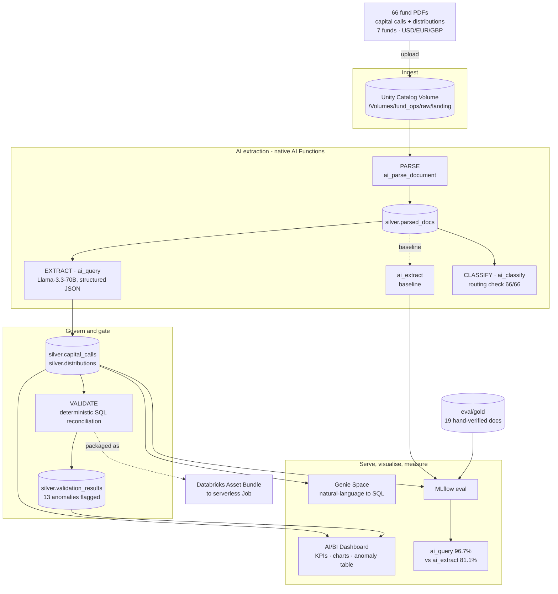
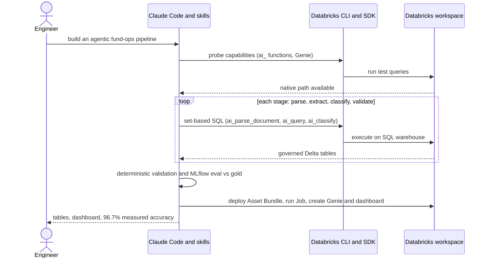
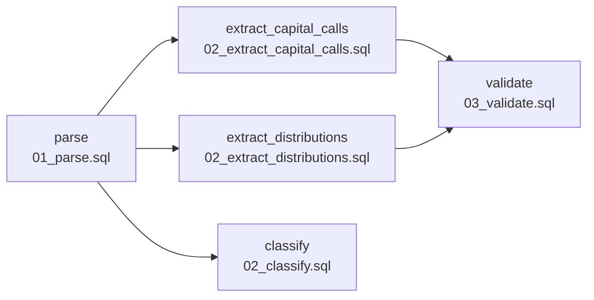
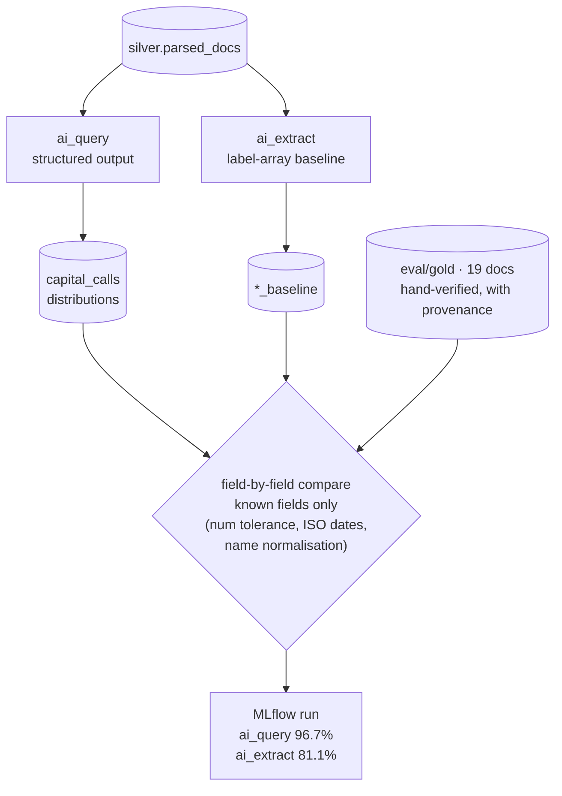
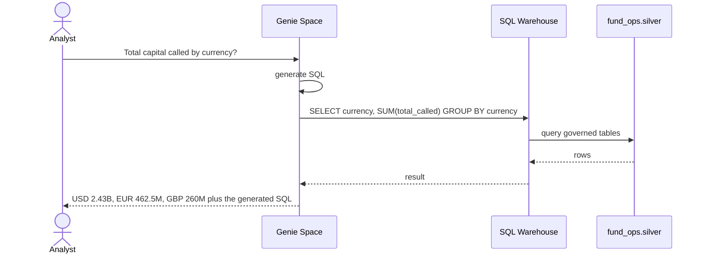
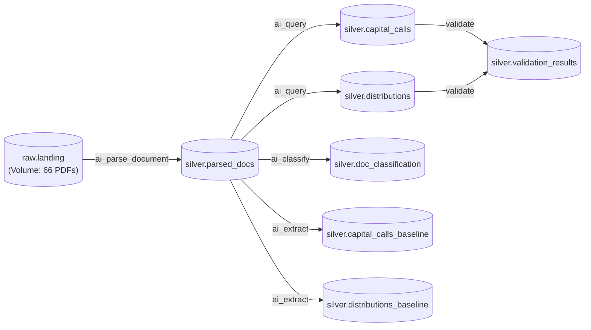

# Architecture & Process Diagrams

All diagrams use [Mermaid](https://mermaid.js.org/) and render directly on GitHub.

---

## 1. End-to-end pipeline

---

## 2. The agentic build loop

How the pipeline was authored and run — an agent (Claude Code + Databricks' official agent-skills) drives the workspace.

---

## 3. Pipeline as a deployable Job (DAB task DAG)

The same SQL, packaged as a Databricks Asset Bundle and run as a serverless Job. Tasks fan out from `parse` and re-converge at `validate`.

---

## 4. The evaluation harness — measure before you trust

Two native extraction strategies are scored against the same hand-verified gold set; only fields whose ground-truth was labelled are scored.

---

## 5. Genie — natural language to SQL

---

## 6. Table lineage (Unity Catalog)

